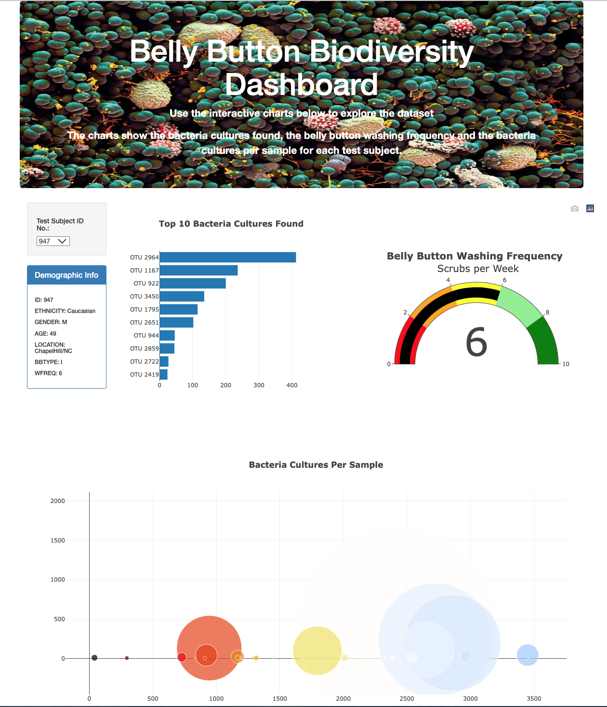

# Belly_Button_Analysis

## Project Overview
Using data provided, build an interactive webpage that includes a dropdown menu, info display and 3 charts. The webpage can be viewed here: https://sgalikeeva.github.io/Belly_Button_Analysis/.

## Resources
Data Source: samples.json
Software: Visual Studio Code 1.63.2

## Results
The webpage takes the data from the samples.json and displays it in an interactive way. The webpage displays a dropdown menu with all the test subject's ID numbers, the user can pick a test subject and see the following:
1) a panel for demographic information
2) the top ten bacteria cultures found - a horizontal bar chart displaying the bacteria cultures in a descending order
3) the belly button washing frequency - a gauge chart displaying the weekly washing frequency's value and the value as a measure from 0-10 on the progress bar 
4) the bacteria cultures per sample - a bubble chart with marker size and color based on sample value and types of bacteria

In addition, using HTML and Bootstrap various components on the webpage were changed to display in a more flattering manner.

The resulting interactive webpage looks like this:

